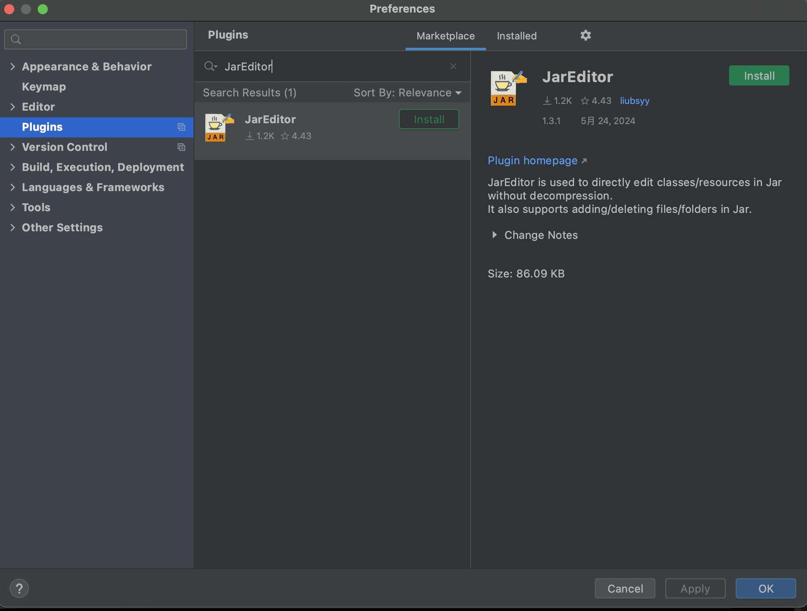
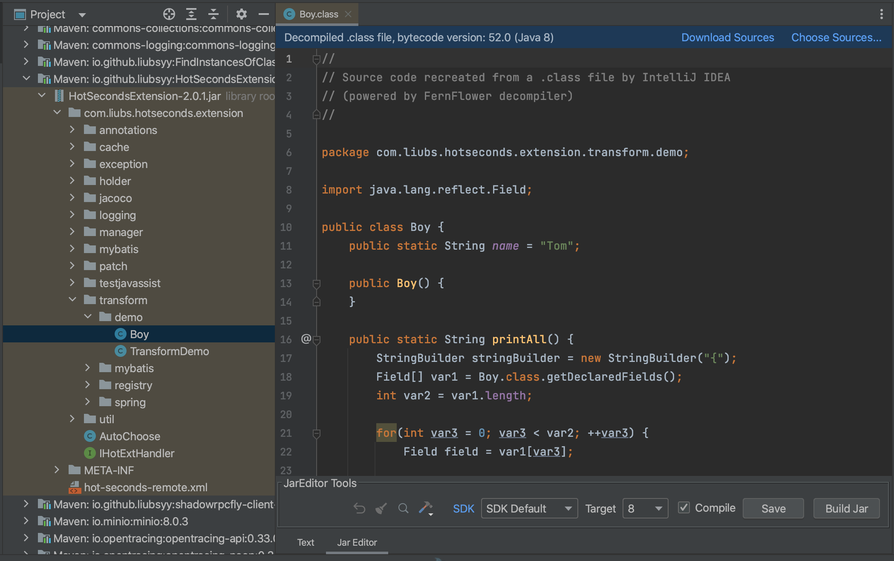
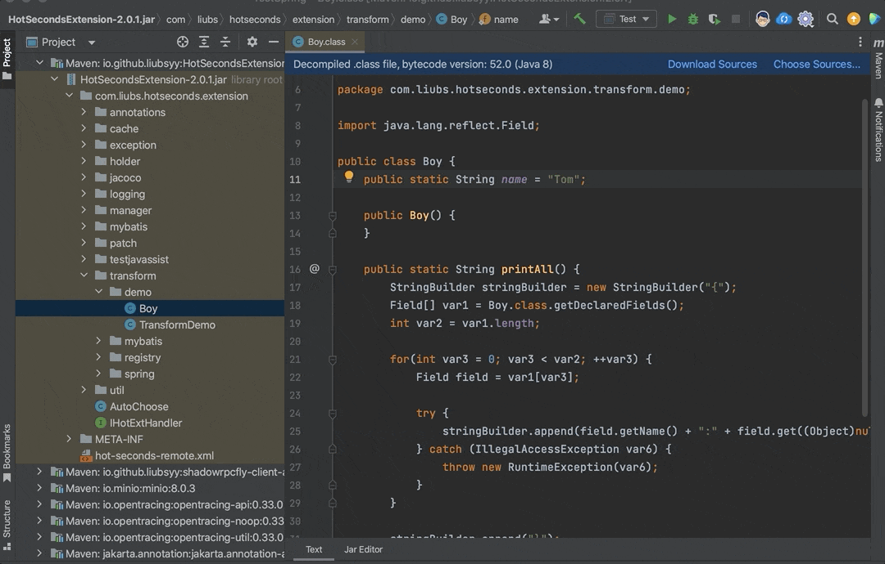
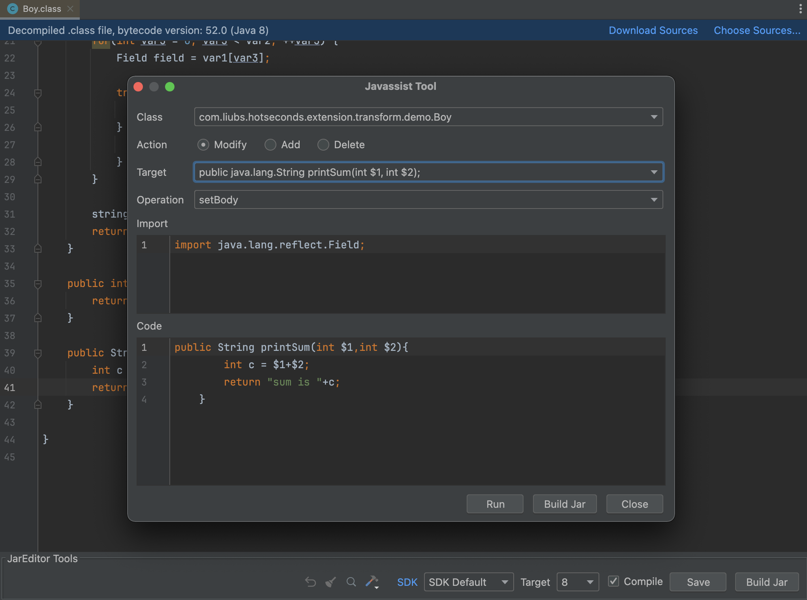
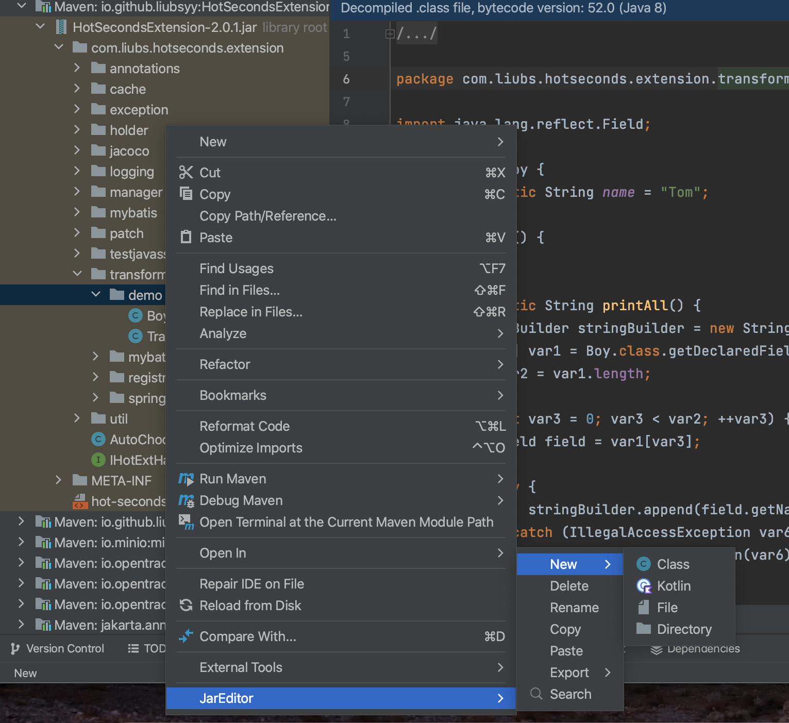
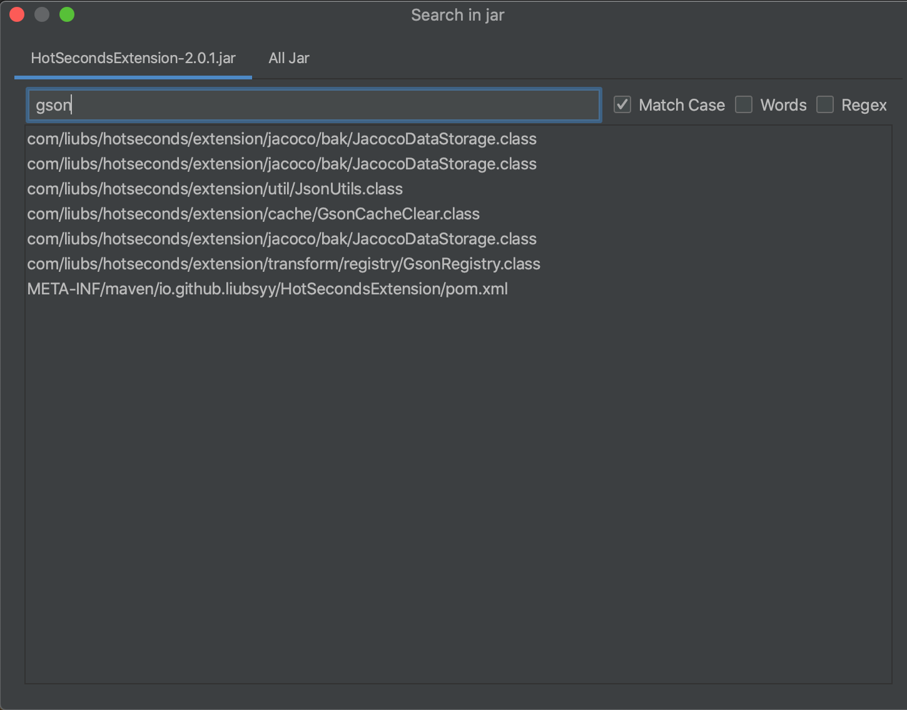

# Guide-第二期🌄

<!--ts-->
* [Guide-第二期🌄](#guide-第二期)
   * [内容](#内容)
      * [1. 下载番茄小说](#1-下载番茄小说)
         * [使用方法](#使用方法)
            * [v1.1.8版本及以上](#v118版本及以上)
            * [v1.07版本及以上：](#v107版本及以上)
            * [目前(v1.1.3版本)保存方式支持：](#目前v113版本保存方式支持)
            * [v1.07以下版本：](#v107以下版本)
      * [1. Java 版的微信聊天记录备份工具](#1-java-版的微信聊天记录备份工具)
         * [🚀 快速启动](#-快速启动)
         * [环境准备](#环境准备)
         * [环境准备](#环境准备-1)
         * [二进制部署](#二进制部署)
         * [本地部署](#本地部署)
      * [2. Spring 源码阅读](#2-spring-源码阅读)
      * [3. 直接编辑 JAR 文件的 IDEA 插件](#3-直接编辑-jar-文件的-idea-插件)
         * [功能](#功能)
         * [快速开始](#快速开始)
            * [1. 从插件市场安装插件](#1-从插件市场安装插件)
            * [2. 编辑并构建 Jar](#2-编辑并构建-jar)
            * [3. 修改字节码工具](#3-修改字节码工具)
            * [4. 其他操作](#4-其他操作)
         * [一些机制](#一些机制)
            * [SDK Default对应JDK版本](#sdk-default对应jdk版本)

<!-- Created by https://github.com/ekalinin/github-markdown-toc -->
<!-- Added by: runner, at: Mon Oct 28 06:51:10 UTC 2024 -->

<!--te-->

## 内容
### 1. 下载番茄小说
>[ying-ck/fanqienovel-downloader](https://github.com/ying-ck/fanqienovel-downloader)

#### 使用方法
##### v1.1.8版本及以上
>1. 输入小说目录页面完整链接或者id下载
>2. 输入id或链接直接下载
>3. 输入1以更新，读取 record.json 中的id进行更新
>4. 输入2进行搜索
>5. 输入3进行批量下载
>6. 输入4进入设置，可调整正文段首占位符，调整延时，小说存储位置，保存模式
>7. 输入5进行备份下载的小说以及下载格式、段首空格等
>8. 输入6退出程序

##### v1.07版本及以上：
>1. 输入小说目录页面完整链接或者id下载
>2. 输入1以更新，读取 record.json 中的id进行更新
>3. 输入2进行搜索
>4. 输入3进行批量下载
>5. 输入4进入设置，可调整正文段首占位符，调整延时，小说存储位置，保存模式
>6. 输入5退出程序

##### 目前(v1.1.3版本)保存方式支持：
>1.整本保存 
>2.分章保存 
>3.EPUB电子书格式保存 
>4.html格式保存 
>5.Latex格式保存

<strong>请注意！修改了设置中的每一个选项都会覆盖原来的数据，请仔细查看后在做出选择。若想修复默认选项，请将config.json文件删除</strong>

##### v1.07以下版本：
>1. 输入id以下载，如：**fanqienovel.com/page/7276384138653862966** 中的 **7276384138653862966**(可能会有另外两种：**fanqienovel.com/page/7276384138653862966?enter_from=stack-room**、**fanqienovel.com/page/7276384138653862966?enter_from=menu**，这样依旧选择数字：**7276384138653862966**)
>2. 输入1以更新，读取 record.json 中的id进行更新
>3. 输入2进入设置，可调整正文段首空格数，但空格数不为0时会花费额外时间进行处理；可选择下载小说保存方式(1.保存为单个txt；2.分章保存)；可选择小说保存路径；可选择章节下载间隔延迟(以避免对服务器造成过大压力，若延迟过小，可能导致你的IP地址被封)
>4. 输入3退出程序


### 1. Java 版的微信聊天记录备份工具
>[xuchengsheng / wx-dump-4j](https://github.com/xuchengsheng/wx-dump-4j)


这是一款基于 Java 开发的微信数据分析工具。它可以管理/导出微信聊天中的引用、图片、表情等消息，支持微信多开、找回删除好友、统计收发消息、查看历史朋友圈等功能。
#### 💡 主要功能
- 👤 **获取用户信息**：获取当前登录微信的详细信息，包括昵称、账号、手机号、邮箱、秘钥、微信Id。
- 💬 **支持多种消息类型**：管理微信聊天对话中的文本、引用、图片、表情、卡片链接、系统消息等。
- 📊 **综合管理**：提供微信会话、联系人、群聊与朋友圈的全面管理功能。
- 📥 **记录导出**：支持导出微信聊天记录、联系人、已删除好友和群聊信息，便于备份和管理。
- 📅 **查看历史朋友圈**：突破三日限制，查看更久以前的朋友圈历史记录，方便回顾和管理。
- 📈 **微信统计功能**：展示微信好友数、群聊数及今日收发消息总量，了解社交活跃度。
- 📊 **消息统计**：统计过去15天内每日微信消息数量，掌握长期消息交流情况。
- 🔝 **互动联系人**：展示最近一个月互动最频繁的前10位联系人，了解重要社交联系。
- 🧩 **消息类别占比**：展示微信消息类别占比图表，分析不同类型消息的占比情况。
- ☁️ **关键字词云**：展示微信最近使用的关键字词云图，分析聊天内容重点。
- 🔄 **找回已删除好友**：支持找回已删除的微信好友，恢复重要联系人。
- 🖥️ **微信多开支持**：支持微信多开功能，方便管理多个账号，提高效率。

#### 🚀 快速启动

本指南将帮助您快速启动并运行项目，无论是安装包部署还是本地部署。

#### 环境准备

在开始之前，请确保您的开发环境满足以下要求：

- 安装 [Java](https://repo.huaweicloud.com/java/jdk/11.0.2+9/jdk-11.0.2_windows-x64_bin.exe)，版本为 JDK 11+。
- 安装 [Node.js](https://nodejs.org/en/)，版本为 18+。
- 安装 [Maven](https://maven.apache.org/download.cgi)，版本为 3.5.0+。
- 选择一款开发工具，比如 IntelliJ IDEA。

#### 环境准备

在开始之前，请确保您的开发环境满足以下要求：

- 安装 [Java](https://repo.huaweicloud.com/java/jdk/11.0.2+9/jdk-11.0.2_windows-x64_bin.exe)，版本为 JDK 11+。
- 安装 [Node.js](https://nodejs.org/en/)，版本为 18+。
- 安装 [Maven](https://maven.apache.org/download.cgi)，版本为 3.5.0+。
- 选择一款开发工具，比如 IntelliJ IDEA。

#### 二进制部署

- 点击下载最新版 [wx-dump-4j-bin.tar.gz](https://github.com/xuchengsheng/wx-dump-4j/releases/download/v1.1.0/wx-dump-4j-bin.tar.gz)。

- 解压缩 `wx-dump-4j-bin.tar.gz` 文件，并进入 `bin` 目录。

- 双击 `start.bat` 启动文件。

- 启动成功后，在浏览器中访问 [http://localhost:8080](http://localhost:8080) 以查看应用。

#### 本地部署

- 下载源码：
```bash
$ git clone https://github.com/xuchengsheng/wx-dump-4j.git
```
- 安装后端依赖：
```bash
$ cd wx-dump-4j mvn clean install
```
- 使用开发工具（如 IntelliJ IDEA）启动 com.xcs.wx.WxDumpApplication。
- 安装前端依赖：
```bash
$ cd wx-dump-ui npm install
```
- 启动前端服务：
```bash
$ npm run start
```
- 前端服务启动成功后，在浏览器中访问 http://localhost:8000 以查看应用。

### 2. Spring 源码阅读
>[xuchengsheng/spring-reading](https://github.com/xuchengsheng/spring-reading)

这是一份讲解 Spring 源码的图文教程，内容涵盖了 Spring 框架的核心概念和关键功能，而且还贴心地标注了难度等级，更加便于学习。


### 3. 直接编辑 JAR 文件的 IDEA 插件
>[Liubsyy / JarEditor](https://github.com/Liubsyy/JarEditor)

IDEA plugin for directly editing and modifying files in jar without decompression. （一款无需解压直接编辑修改jar包内文件的IDEA插件）

可直接修改jar包内文件的IDEA插件，无需解压

**Plugin marketplace** : [https://plugins.jetbrains.com/plugin/24397-jareditor](https://plugins.jetbrains.com/plugin/24397-jareditor)

#### 功能
- 直接编辑jar包内class/resource文件，无需解压
- 添加/删除/重命名jar包内文件/文件夹
- 搜索jar包的内容
- jar内复制/粘贴文件到外部剪切板
- 支持SpringBoot jar/嵌套jar
- 支持kotlin
- 可导出source jar
- 支持class字节码修改工具 : javassist
- 反编译器 : Fernflower/CFR/Procyon

#### 快速开始

##### 1. 从插件市场安装插件
首先从市场安装插件 JarEditor，IDEA版本 >= **2020.3**




##### 2. 编辑并构建 Jar
安装完成后，在.class反编译文件中可以看到切换到Jar Editor的tab页。

> **外部jar** ：File->Project Structure->Libraries->Add Library，然后就可以看到反编译的jar了。<br>
> **嵌套jar** : 嵌套jar上右键->JarEditor->Structure->Expand Nested Jar



修改完成后，点击**Save（Compile）**，编译并保存当前修改的java内容。

最后点击**Build Jar**，将编译保存的类文件写入Jar包中。

修改jar包中的资源文件也是支持的。

下面是一个演示例子:



##### 3. 修改字节码工具
针对混淆jar，反编译的效果不是很好，此时可以使用直接修改字节码工具
点击 **Class bytes tool** 图标选择工具

- **Javassist** : 可以对字段/方法/构造函数/静态代码块进行增删改 (包括内部类)




##### 4. 其他操作
在jar包的项目视图中，右键可以看到**JarEditor->New/Delete**等操作，可以在jar内添加/删除/重命名/复制/粘贴/导出文件。



点击 **Search** 图标，可以搜索jar包的内容，如果是class jar将根据反编译的内容进行搜索




#### 一些机制
- 编译依赖的JDK是你的SDK列表中的JDK。您可以选择SDK和编译类的目标版本。
- 编译java时所依赖的classpath就是项目的Libraries依赖。如果找不到依赖包，可以添加Libraries(File->Project Structure->Libraries)。
- Save(Compile)会将修改后的文件保存到jar包所在目录的子目录**jar_edit_out**中，Build Jar会将修改的文件增量写入jar中，最后删除这个临时目录。

##### SDK Default对应JDK版本

编译选择 **SDK Default** 时，使用的是Jetbrains集成的运行时JDK(JBR)，如果不选SDK Default则是具体用户安装的JDK

IDEA|JDK
---|---
IDEA 2020.3 - IDEA 2022.1 |JBR JDK11
IDEA 2022.2 - IDEA 2024.1 |JBR JDK17
IDEA 2024.2 及更高版本 |JBR JDK21


